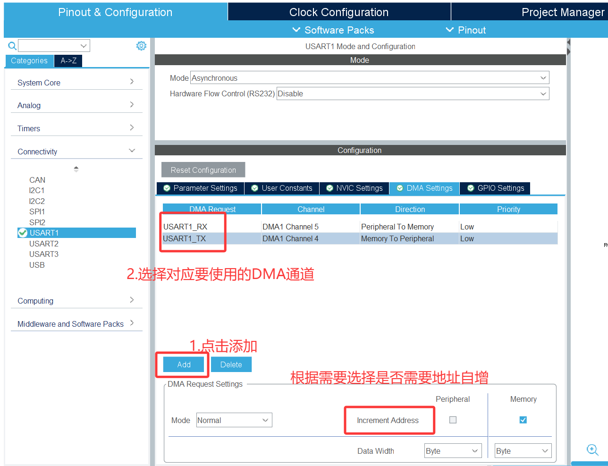

# GPIO
## 流水灯
- **基本配置**

LED小灯阴极接地

推挽输出,默认输出为低电平

- **代码**

```c
  /* USER CODE BEGIN WHILE */
  while (1)
{ //LED1
    HAL_GPIO_WritePin(LED1_GPIO_Port, LED1_Pin, GPIO_PIN_SET);
    HAL_Delay(300);
    HAL_GPIO_WritePin(LED1_GPIO_Port, LED1_Pin, GPIO_PIN_RESET);
    //LED2
    HAL_GPIO_WritePin(LED2_GPIO_Port, LED2_Pin, GPIO_PIN_SET);
    HAL_Delay(300);
    HAL_GPIO_WritePin(LED2_GPIO_Port, LED2_Pin, GPIO_PIN_RESET);
    //LED3
    HAL_GPIO_WritePin(LED3_GPIO_Port, LED3_Pin, GPIO_PIN_SET);
    HAL_Delay(300);
    HAL_GPIO_WritePin(LED3_GPIO_Port, LED3_Pin, GPIO_PIN_RESET);
    //LED4
    HAL_GPIO_WritePin(LED4_GPIO_Port, LED4_Pin, GPIO_PIN_SET);
    HAL_Delay(300);
    HAL_GPIO_WritePin(LED4_GPIO_Port, LED4_Pin, GPIO_PIN_RESET);
    //LED5
    HAL_GPIO_WritePin(LED5_GPIO_Port, LED5_Pin, GPIO_PIN_SET);
    HAL_Delay(300);
    HAL_GPIO_WritePin(LED5_GPIO_Port, LED5_Pin, GPIO_PIN_RESET);
    //LED6
    HAL_GPIO_WritePin(LED6_GPIO_Port, LED6_Pin, GPIO_PIN_SET);
    HAL_Delay(300);
    HAL_GPIO_WritePin(LED6_GPIO_Port, LED6_Pin, GPIO_PIN_RESET);
    //LED7
    HAL_GPIO_WritePin(LED7_GPIO_Port, LED7_Pin, GPIO_PIN_SET);
    HAL_Delay(300);
    HAL_GPIO_WritePin(LED7_GPIO_Port, LED7_Pin, GPIO_PIN_RESET);
   
    /* USER CODE END WHILE */
}
```

> *注*
>
> 也可以使用`HAL_GPIO_TogglePin`来实现

## 按键控制小灯
 **基本配置**
  * 按键选输入,连接时一边接正极,一边接引脚
  * 小灯和上一个案例一样

- **代码**

```c
 /* USER CODE BEGIN WHILE */
 while (1)
{
      /*                   按键控制小灯亮灭翻转                    */
    if(HAL_GPIO_ReadPin(KEY1_GPIO_Port, KEY1_Pin)==GPIO_PIN_SET)
      {//软件消抖：先延时一会再继续检测
        HAL_Delay(50);
        if(HAL_GPIO_ReadPin(KEY1_GPIO_Port, KEY1_Pin)==GPIO_PIN_SET)
          {
           //等待按键松开再执行翻转，否则会因为按下时间过长小灯亮灭一直翻转
           while(HAL_GPIO_ReadPin(KEY1_GPIO_Port, KEY1_Pin)==GPIO_PIN_RESET){};
           HAL_GPIO_TogglePin(BLUE_GPIO_Port, BLUE_Pin);
         }
      }
  /*                   按键长按控制小灯亮灭                    */
    if(HAL_GPIO_ReadPin(KEY2_GPIO_Port, KEY2_Pin)==GPIO_PIN_SET)
      {
        HAL_GPIO_WritePin(RED_GPIO_Port, RED_Pin, GPIO_PIN_SET);
      }   
    else
    {
        HAL_GPIO_WritePin(RED_GPIO_Port, RED_Pin, GPIO_PIN_RESET);
	}   

    /* USER CODE END WHILE */
}
```


# 中断

## 一灯闪烁,另一灯按键控制

- **基本配置**
  - LED灯:推挽输出+默认低电平(看个人硬件电路连接)+无上下拉
  - 按键:外部中断模式+下降沿触发加上拉电阻(看个人硬件电路连接)
  - 若要在中断中调用`Delay`函数,记得调整NVIC

- **代码**

while主循环

```c
/* USER CODE BEGIN WHILE */
while (1)
{
    /*      LED1小灯闪烁     */
    HAL_GPIO_WritePin(LED1_GPIO_Port,LED1_Pin,GPIO_PIN_SET);
    HAL_Delay(300);  
    HAL_GPIO_WritePin(LED1_GPIO_Port,LED1_Pin,GPIO_PIN_RESET);
    HAL_Delay(300);

    /* USER CODE END WHILE */

    /* USER CODE BEGIN 3 */
}
  /* USER CODE END 3 */
```

中断函数处

```c
void EXTI15_10_IRQHandler(void)
{
  /* USER CODE BEGIN EXTI15_10_IRQn 0 */

  
  /*     按键控制小灯亮灭翻转      */
  //软件消抖
  HAL_Delay(10);
  if(HAL_GPIO_ReadPin(KEY1_GPIO_Port, KEY1_Pin)==GPIO_PIN_RESET)
  {
    HAL_GPIO_TogglePin(LED2_GPIO_Port, LED2_Pin);
    //等待按键松开
    while(HAL_GPIO_ReadPin(KEY1_GPIO_Port, KEY1_Pin)==GPIO_PIN_SET);
  }
  
  
  /* USER CODE END EXTI15_10_IRQn 0 */
  HAL_GPIO_EXTI_IRQHandler(KEY1_Pin);
  /* USER CODE BEGIN EXTI15_10_IRQn 1 */

  /* USER CODE END EXTI15_10_IRQn 1 */
}

```

# 串口通信

## 电脑指令控制小灯状态
**基本配置**
  - 小灯配置和GPIO一节一样
  - 串口选择USART1

- **代码**

导入库(非必要)

```c
/* USER CODE BEGIN Includes */
#include <stdint.h>
#include<string.h>
/* USER CODE END Includes */
```

准备数据缓冲区

```c
  /* USER CODE BEGIN 2 */
  uint8_t r_data[2];//用于接收数据的存放
  GPIO_PinState S;//定义引脚状态，便于后续直接更改
  /* USER CODE END 2 */
```

主循环处

```c
  /* USER CODE BEGIN WHILE */

while (1)
{
    //接收数据，一直等待
    HAL_UART_Receive(&huart1,r_data,2  ,HAL_MAX_DELAY);
    //接收后发回电脑
    HAL_UART_Transmit(&huart1, r_data, 2, 10);

    //判断实现控制小灯
    if(r_data[1] == '1')
    {
      S = GPIO_PIN_SET;
    }
    else
    {
      S = GPIO_PIN_RESET;
    }

    if(r_data[0] == 'Y')
    {
      HAL_GPIO_WritePin(YELLOW_GPIO_Port, YELLOW_Pin, S);
    }
    else if(r_data[0] == 'R')
    {
      HAL_GPIO_WritePin(RED_GPIO_Port , RED_Pin, S);
    }
    else if(r_data[0] == 'B')
    {
      HAL_GPIO_WritePin(BLUE_GPIO_Port, BLUE_Pin, S);
    }
  
  /* USER CODE END WHILE */

  /* USER CODE BEGIN 3 */
}
  /* USER CODE END 3 */

```

- **注意事项**
  - 单引号和双引号不一样

## 中断方式实现
- **基本配置**

和轮询模式一样

**但是要注意在NVIC中打开USART的中断**

- **代码**

变量定义

```c
/* USER CODE BEGIN PV */
uint8_t r_data[2];//用于接收数据的存放
GPIO_PinState S;//定义引脚状态，便于后续直接更改
/* USER CODE END PV */
```

> 由于涉及回调函数,所以定义变量为全局变量
>
> 在`PV`(private,variable)注释对中注释

接收数据

```c
 /* USER CODE BEGIN 2 */
 HAL_UART_Receive_IT(&huart1,r_data,2);
 /* USER CODE END 2 */
```

> 此函数不可以放在主循环里面，否则会因为数据未接受完就开启下一次循环导致数丢失

> 但是怎么知道数据接收完成了呢,完成后干啥呢?
>
> 这就需要中断处理函数,但是由于UART的中断处理函数时共用的所以需要使用回调函数来执行(HAL库官方写好的判断逻辑)

回调函数

```c
/* USER CODE BEGIN 0 */
 void HAL_UART_RxCpltCallback(UART_HandleTypeDef *huart)
  {
    //接收后发回电脑
    HAL_UART_Transmit_IT(&huart1, r_data, 2);

    //判断实现控制小灯
    if(r_data[1] == '1')
    {
      S = GPIO_PIN_SET;
    }
    else
    {
      S = GPIO_PIN_RESET;
    }

    if(r_data[0] == 'Y')
    {
      HAL_GPIO_WritePin(YELLOW_GPIO_Port, YELLOW_Pin, S);
    }
    else if(r_data[0] == 'R')
    {
      HAL_GPIO_WritePin(RED_GPIO_Port , RED_Pin, S);
    }
    else if(r_data[0] == 'B')
    {
      HAL_GPIO_WritePin(BLUE_GPIO_Port, BLUE_Pin, S);
    }
    //为下一次接收数据开启
    HAL_UART_Receive_IT(&huart1,r_data,2);
  }
/* USER CODE END 0 */
```

> 回调函数的定义要在user 0注释对之中
>
> 且在执行完之后要再一次开启下一次的数据接收,否则接收数据只会执行一次

## DMA实现不定长数据收发

- **基本配置**




开启USART的DMA通道，NVIC会自动开启

- **代码**

定义全局接收变量

```c
/* USER CODE BEGIN PV */
//接收数据，容量根据需要往大了设
uint8_t rx_data[256];
/* USER CODE END PV */
```

开启DMA的接收

```c
  /* USER CODE BEGIN 2 */
  //开启接收数据
  HAL_UARTEx_ReceiveToIdle_DMA(&huart1, rx_data, sizeof(rx_data));
  // 关闭DMA传输过半中断（HAL库默认开启，但我们只需要接收完成中断）
  __HAL_DMA_DISABLE_IT(huart1.hdmarx, DMA_IT_HT);
  /* USER CODE END 2 */
```

在回调函数中写中断逻辑

```c
/* USER CODE BEGIN 0 */
// 不定长数据接收完成回调函数
void HAL_UARTEx_RxEventCallback(UART_HandleTypeDef *huart, uint16_t Size)
{
    if (huart == &huart1)
    {
        // 使用DMA将接收到的数据发送回去
        HAL_UART_Transmit_DMA(&huart1, rx_data, Size);
        // 重新启动接收，使用Ex函数，接收不定长数据
        HAL_UARTEx_ReceiveToIdle_DMA(&huart1, rx_data, sizeof(rx_data));
        // 关闭DMA传输过半中断（HAL库默认开启，但我们只需要接收完成中断）
        __HAL_DMA_DISABLE_IT(huart1.hdmarx, DMA_IT_HT);
    }
}
/* USER CODE END 0 */
```

**注意**

此处要使用UART的扩展(Expand)函数中的接收事件的回调

和前面的回调唯一区别在于需要传入数据的大小(因为是不定长数据)

# TIM
## 呼吸灯
**基本配置**

高速时钟源为晶振,频率72MHz

预分频设置为72-1,自动重装载设置为100-1

**代码**

```c
  /* USER CODE BEGIN 2 */
  //启动tim
  HAL_TIM_PWM_Start(&htim3, TIM_CHANNEL_1);
  /* USER CODE END 2 */
```

```c
/* USER CODE BEGIN WHILE */
while (1)
{
    //循环设置比较寄存器，实现呼吸效果
    for(int i = 0;i<=99;i++)
    {
      __HAL_TIM_SET_COMPARE(&htim3, TIM_CHANNEL_1, i);
      HAL_Delay(10);
    }
      for(int i = 99;i>=0;i--)
    {
      __HAL_TIM_SET_COMPARE(&htim3, TIM_CHANNEL_1, i);
      HAL_Delay(10);
    }
    HAL_Delay(100);

    /* USER CODE END WHILE */

    /* USER CODE BEGIN 3 */
}
/* USER CODE END 3 */
```

**注意点开tim的初始化检查配置,防止cubemx忘记设置**


## 舵机控制
**SG90舵机基本知识**

要求50Hz的时基脉冲,占空比在`2.5%~12.5%`,对应舵机的`0°~180°`

`2.5%`-------0°	`5%`-------45°	`7.5%`-------90°	`10%`-------135°	`12.5%`-------180°

**配置**

高速时钟源为晶振，主频为72MHz

预分频器为1440-1，自动重装载为1000-1	这样脉冲频率就是$\frac{72*10^6}{1440*1000}=50$

初始比较寄存器的值为25\

**代码**

```c
  /* USER CODE BEGIN 2 */
  uint8_t compare = 25;
  HAL_TIM_PWM_Start(&htim4, TIM_CHANNEL_3);
  /* USER CODE END 2 */
```

```c
  /* USER CODE BEGIN WHILE */
  while (1)
  {
    if(HAL_GPIO_ReadPin(KEY_GPIO_Port, KEY_Pin) == GPIO_PIN_RESET)
    {
      HAL_Delay(30);
      if(HAL_GPIO_ReadPin(KEY_GPIO_Port, KEY_Pin) == GPIO_PIN_RESET)
      {
        while(HAL_GPIO_ReadPin(KEY_GPIO_Port, KEY_Pin));
        __HAL_TIM_SET_COMPARE(&htim4, TIM_CHANNEL_3, compare+25);
      }
    }
    if(compare >= 125)
    {
      compare = 25;
      __HAL_TIM_SET_COMPARE(&htim4, TIM_CHANNEL_3, compare);
    }
    /* USER CODE END WHILE */
  }
```
